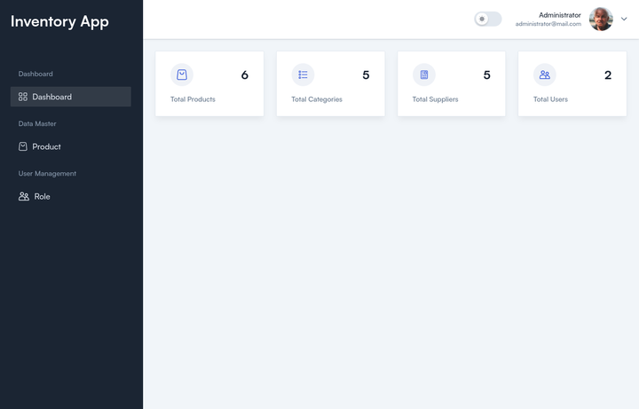
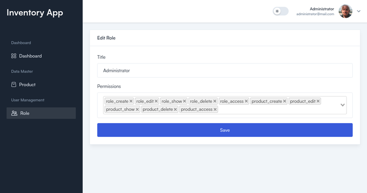

## Inventory Application

#### built with

| Tools  |  |
| :--- | :--- |
| Laravel  | https://laravel.com  |
| InertiaJS  | https://inertiajs.com  |
| Vue | https://vuejs.org  |
| TailAdmin | https://tailadmin.com  |
| etc |  |

## setup

#### tested on

```
rizan@linux ~/Project/laravel-inertia-vue (main) $ php --version                   
PHP 8.2.18 (cli) (built: Apr 11 2024 20:37:35) (NTS)
Copyright (c) The PHP Group
Zend Engine v4.2.18, Copyright (c) Zend Technologies
    with Zend OPcache v8.2.18, Copyright (c), by Zend Technologies

rizan@linux ~/Project/laravel-inertia-vue (main) $ npm -v     
10.5.2

rizan@linux ~/Project/laravel-inertia-vue (main) $ node -v
v20.13.0

```

#### install dependencies
```
composer install
```

```
npm install
```
#### copy .env
```
copy .env.example .env
```
#### generate application key
```
php artisan key:generate
```
#### storage link
```
php artisan storage:link
```
#### DB configuration
- create database and setup .env

```
DB_CONNECTION=mysql
DB_HOST=127.0.0.1
DB_PORT=3306
DB_DATABASE=<DB_NAME>
DB_USERNAME=<DB_USERNAME>>
DB_PASSWORD=<DB_PASSWORD>
```
#### data example 
> database/seeders


#### database migration and seeder
```
php artisan config:cache
php artisan config:clear
composer dump-autoload
php artisan migrate:fresh --seed
```
#### runnning
```
php artisan serve
```

```
npm run dev
```

#### screenshots





